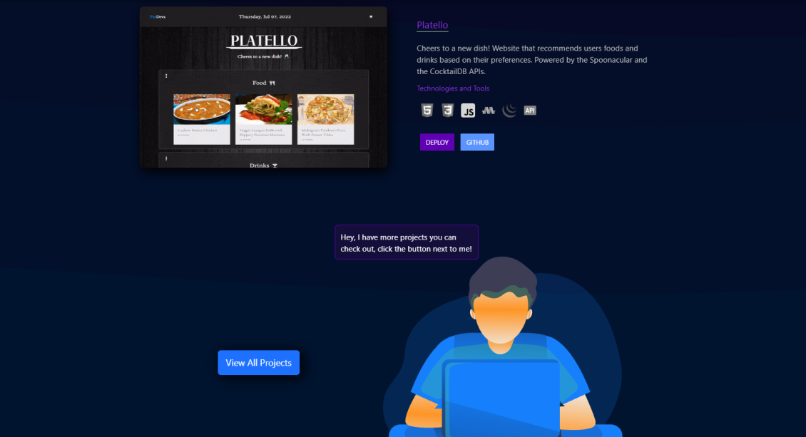
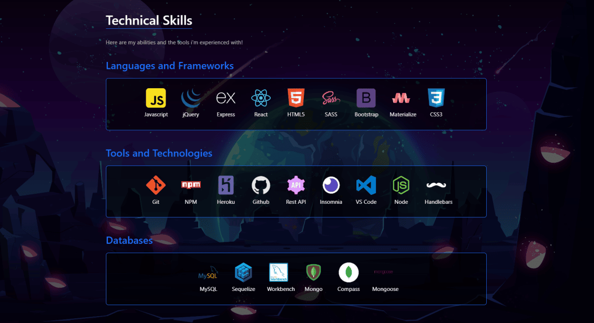
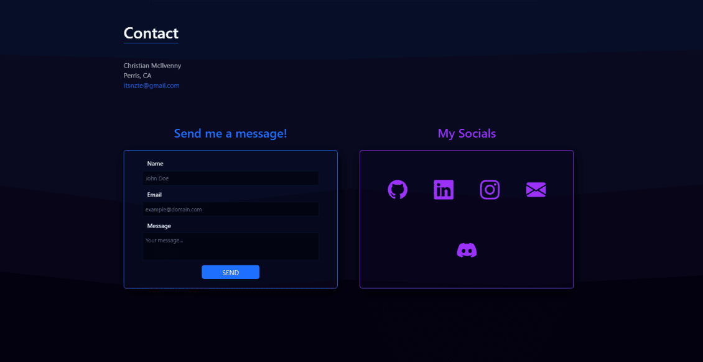
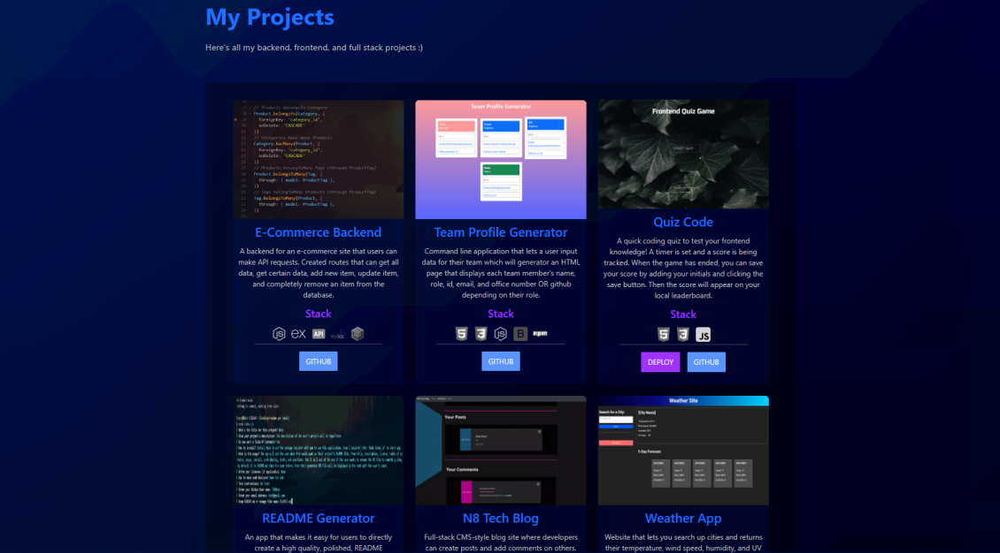

# Nate's React Portfolio

This is my main portfolio that I will be presenting which showcases my projects, experience, and skills. 🙂

My portfolio has an about me, projects, skills, and a contact section modularized into components. And if the viewer chooses to dedicate their attention to just my projects, I created a whole page displaying every single one of my projects and the tools I used to create it.

This website is powered my React.js, and is deployed on Github pages.

Deployed: https://www.natemci.com

[](https://opensource.org/licenses/MIT)

[MIT](https://choosealicense.com/licenses/mit/)

## Table Of Contents

- [Technologies](#technologies)
- [Install](#install)
- [Screenshots](#screenshots)
- [Contribute](#contributing)
- [Questions](#questions)

## Technologies

Here are the technologies I used for this app

- [React](https://reactjs.org/)
- [Emailjs](https://www.emailjs.com/)
- [Bootstrap](https://getbootstrap.com/)
- [SweetAlert](https://sweetalert.js.org/guides/)
- [Github Pages](https://pages.github.com/)

## Install

If you would like to use this layout, you can clone or fork, and run `npm install` to install all the packages needed to run this application.

But before you install, in order for you to get emails from the contact form, you have to link up your keys in the `.env`. I used Emailjs to take care of that for me, but please read the docs -> **[EmailJS Docs](https://www.emailjs.com/docs/)**.

Once you have a solid idea of how to create your email templates, and how to get your emailjs keys, then go to the `.env.EXAMPLE` file in the root, remove the ".EXAMPLE" and add your Emailjs variables.

```
 REACT_APP_SERV_KEY=( Your Server key )
 REACT_APP_FORM_TEMPLATE=( Your Template )
 REACT_APP_FORM_PUB_KEY=( Your public Key )
```

_Note: remove the parenthesis and make sure there's no spaces_

After getting those set up, run `npm start` to start the application.

## Screenshots

  
  
  
  
  

## Contributing

Fork this, and make your pull request :)

## Questions

_Reach Out!_

Github: [TDGNate](https://github.com/TDGNate)

Email: itsnzte@gmail.com
